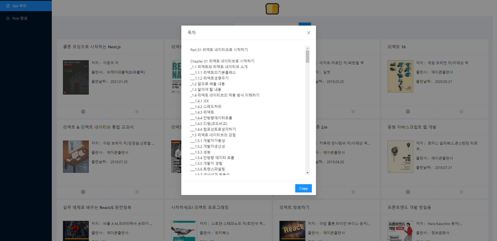

# Cream Bread

## 1. 개요
- 독서 기록을 할 때 목차를 기준으로 내용을 정리하고 싶은데 목차를 가져오는 것을 보다 간편하게 하고 싶어서 제작하게 됨.

## 2. 목표

- 반응형 적용

## 3. 기능 명세

- 도서 검색
- 각 도서 별로 yes24 의 상품 페이지에 접속
- 각 도서의 목차를 팝업 창으로 볼 수 있으며 버튼 클릭 한번으로 복사가 가능하다.
  - 목차는 yes24 의 상품 페이지의 목차 내용을 크롤링함

## 5. 참고

- [Ant Design](https://ant.design/)
- [CORS는 왜 이렇게 우리를 힘들게 하는걸까?](https://evan-moon.github.io/2020/05/21/about-cors/)

## 6. 후기

- 처음에 네이버 API 를 사용하는 것을 시도하였으나 Open API 는 적용했지만 네이버 책의 상품 페이지에서 가져오는 것은 실패하였다. CORS 문제였는데 Proxy 를 별도로 만들었지만 통하지가 않았다. 그래서 온라인 서점을 이용하기로 했는데 그 중 yes24 의 정보를 원활하게 가져올 수 있어서 변경하였다.